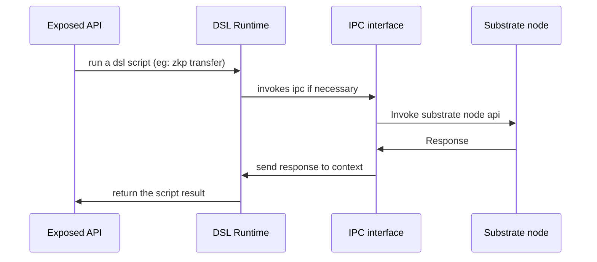

# Introduction

Suter_cli is the client of suterusu chain, there are three main components of
suter_cli:
- The connection component
- A domain specific lanugae(DSL)
- A runtime executor


The architecture of the client:

1. Client exposed js API or Client exposed ocaml API (js api is translated from ocaml by ocaml_to_js)
2. script files written in client dsl + dsl runtime
3. jsonrpc interface (built on ocaml websocket / js websocket interface)

Currently this repo is still under development. The following is a brief progress report.
[  ] Exposed API: (calls the client dsl executor and runs the dsl script).
Once the framework is done. We can easily change algorithms by changing the underlying scripts.

[X] Client DSL: (alpha version with very basic syntax).
The main structure of the dsl is fixed and we are adding more semantic elements (including hash functions, IPC error handers, transaction, etc ...).

[X] Runtime:
The runtime only supports linear execution at the moment.

# Install Suter Client
## Before compilation. 
$ Install opam 2.0.5
$ with ocaml into a version >= 4.7.0
## Compile Suter Client
$ suter_cli > ./configure.sh
$ suter_cli > make
## Run Suter Client in command mode
$ start your substrate node which listens localhost:9944
$ suter_cli > ./wsclient.native -url http://127.0.0.1:9944

# Component details:

1. The connection component:

It uses websocket in ligth weight thread (Lwt) and provides several convinent interfaces to make jsonrpc calls. This module wraps IPCs to nodes so that an ipc call looks like a function call in our client DSL (See client DSL for more details). 

2. A domain specific language for client to define transactions.

Firing a transaction in a zkp setting sometimes involves a few IPCs to(from) nodes. Instead of hard coding those transaction logic, we uses a domain specific language (client DSL) to define the transaction logic and the uses an executor to execute the transaction.

You will have two ways to execute the Client DSL.

a. You can uses wsclient to open an interactive executor.

```
> wsclient.native -url http:127.0.0.1  
```

In the interactive executor, you can typing and executing commands like the following:

```
> id := [0]
//An extended json format which can reuse local variables in json fields.
> @send id |> chain_getBlockHash
```

which will give you result as follows:

```
> Response: "0x2895bf7b698e2efaa18eb3a1f0980f983a7778ca74a9abf123e1d08f9789c66b"
```

Also, you can store the result in a local variable for future use:

```
hash := @send id |> chain_getBlockHash
```

Here, a node remote json api chain_getBlockHash is invoked and id is a json object (in the current client dsl closure).

We also do type check for all those jsonrpc calls so that we can check the validation of our client dsl script. Forexample, the following script will raise an TypingError which has rich information for debugging purpose.

Please refer to the DSL syntax and semantics for more details.

b. (Under development) You can write the client dsl in files, for example in an anonymouse balance transfer, we can define the transfer transaction as follows.

transfer.sbl

```
> r := @sender_random_data
> A := @sender_public_key
> B := @send |> get_receiver_public_key
> R := @curve_public_key r G
> DestAddr := H_s(rA)G + B
> @send {transaction DestAddr, R} |> transfer
```

3. A runtime executor that can execute and debug the client dsl scripts. 



# Example:
## Get block hash:

```
suter_cli > ./wsclient.native -url http://127.0.0.1:9944 
> idx := [0]
> @send idx |> chain_getBlockHash
> (* Response displayed here *)
```

## Get current version
```
suter_cli > ./wsclient.native -url http://127.0.0.1:9944 
> param := []
> @send param |> state_getRuntimeVersion
> (* Response displayed here *)
```
